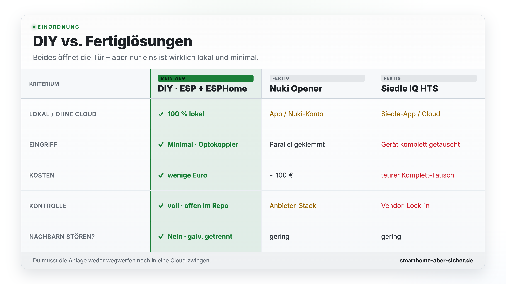

# Siedle HTS 811-0 mit ESPHome smart machen

Dieses Repo zeigt, wie man eine **Siedle Türsprechanlage (Haustelefon HTS 811-0, 1+n-Technik)**
minimalinvasiv und lokal in Home Assistant einbindet – **ohne** die Anlage umzubauen und
**ohne** ein proprietäres Bus-Protokoll zu reverse-engineeren.

> Begleitmaterial zum Video von **[Smarthome? Aber sicher!](https://smarthome-aber-sicher.de)**

## Die Idee in einem Satz

**Du musst die Anlage nicht technisch verstehen – du musst nur zwei Dinge können:
Signale erkennen und Knöpfe drücken.**

- **Lesen (Eingänge):** Klingel Tür + Klingel Wohnung
- **Steuern (Ausgänge):** Türöffner + Licht

Ein Optokoppler erkennt eine Spannungsänderung (= es klingelt), ein Ausgang „drückt" für
einen kurzen Moment einen vorhandenen Knopf (= Tür auf / Licht an). Mehr ist es nicht.
Genau deshalb lässt sich das Prinzip auf fast **jede** Türsprechanlage übertragen – nur
die Klemmen heißen woanders anders.

## ⚠️ Sicherheitshinweis

Arbeiten an der Türsprechanlage erfolgen auf eigene Gefahr. An den Klemmen liegen je nach
Anlage Gleich- **und** Wechselspannungen an. Immer spannungsfrei arbeiten, sauber messen
und die vorhandene Verkabelung nicht kurzschließen. Die galvanische Trennung über
Optokoppler ist bewusst gewählt, um Anlage und Mikrocontroller sauber zu entkoppeln und
andere Innenstationen nicht zu stören.

**Diese Konfiguration ist für genau meine Anlage (HTS 811-0, 1+n) dokumentiert.** Bei
anderen Geräten/Generationen können Klemmenbelegung und Spannungen abweichen – Prinzip
gleich, Details prüfen.

## Dateien

| Datei / Ordner | Inhalt |
|---|---|
| `doorbell.yaml` | ESPHome-Konfiguration für den ESP8266 (NodeMCU) |
| `secrets.yaml.example` | Vorlage für die auszulagernden Secrets |
| `docs/hardware.md` | Klemmenbelegung, Spannungsverlauf, Pin-Mapping, Aufbau |
| `.gitignore` | hält `secrets.yaml` aus dem Repo heraus |

## Hardware

- **Innenstation:** Siedle Haustelefon **HTS 811-0** (1+n-Technik, analog)
- **Controller:** ESP8266 **NodeMCU** (ESP-12F, WLAN)
- **Stromversorgung:** **LM2596** Step-Down-Wandler, versorgt den ESP aus der Anlagenspannung
- **Signalankopplung:** 2× Optokoppler (Eingänge) mit Vorwiderständen, galvanisch getrennt

Details siehe **[docs/hardware.md](docs/hardware.md)**.

## Warum DIY statt Fertiglösung?

Es gibt kommerzielle Wege – die passen aber nicht zum Anspruch „lokal, minimal, ohne Cloud":

| Lösung | Nachteil |
|---|---|
| **Nuki Opener** | Bindung an Nuki-Konto/App-Ökosystem, Batterie, ~100 €; volle Kontrolle nur über den Anbieter-Stack statt sauber lokal |
| **Siedle IQ HTS** | teurer Komplett-Tausch der Innenstation, Siedle-App/Cloud, Vendor-Lock-in, keine offene lokale Schnittstelle |

DIY dagegen: **lokal in Home Assistant**, kein Konto, keine Cloud, wenige Euro
Bauteile – und die vorhandene Anlage bleibt erhalten.

<picture>
  <source media="(prefers-color-scheme: dark)" srcset="docs/images/sb6-vergleich-dark.png">
  
</picture>

## Schnellstart

1. `secrets.yaml.example` nach `secrets.yaml` kopieren und eigene Werte eintragen.
2. **Eigene** Secrets erzeugen (nicht die Beispiele verwenden):
   - API-Key: `openssl rand -base64 32`
   - OTA-/AP-Passwort: frei wählen
3. `doorbell.yaml` mit ESPHome flashen:
   ```bash
   esphome run doorbell.yaml
   ```
4. Gerät in Home Assistant übernehmen (ESPHome-Integration).

## Mitmachen

Hast du eine andere Türsprechanlage (Siedle oder etwas anderes) smart gemacht? Wie würdest
du das erweitern? **Issues und Pull Requests sind willkommen** – teile deine Klemmenbelegung,
Spannungswerte oder Automationen.

## Lizenz

[MIT](LICENSE)
