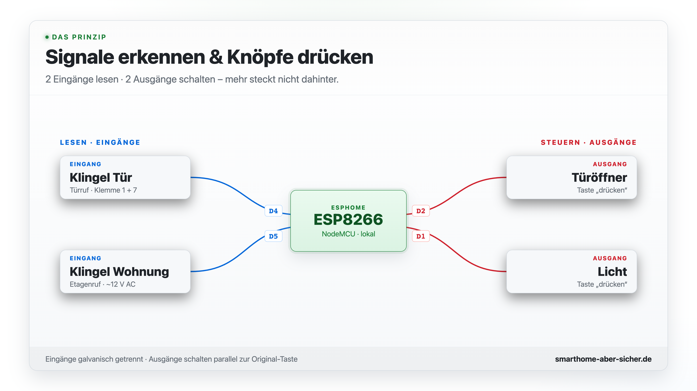
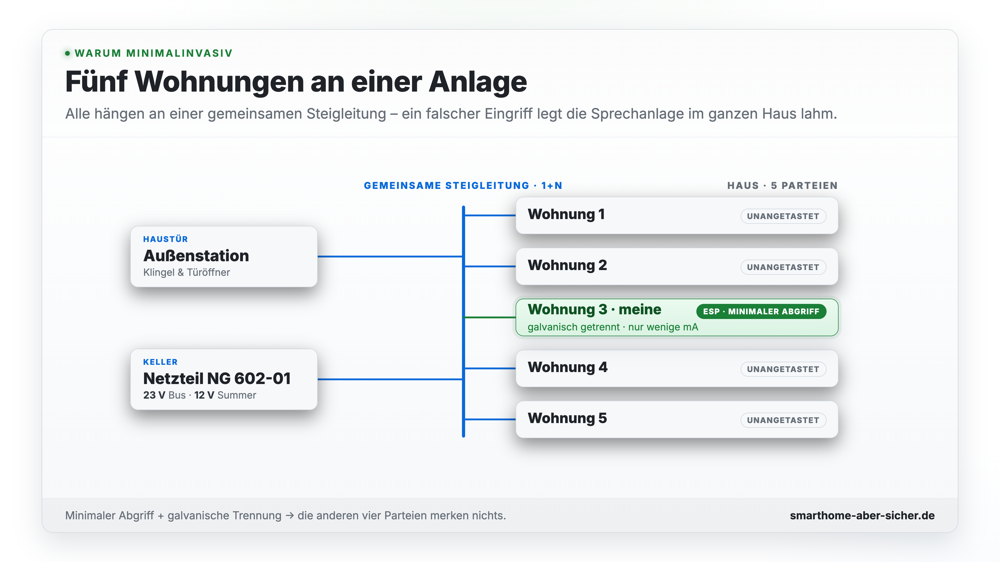
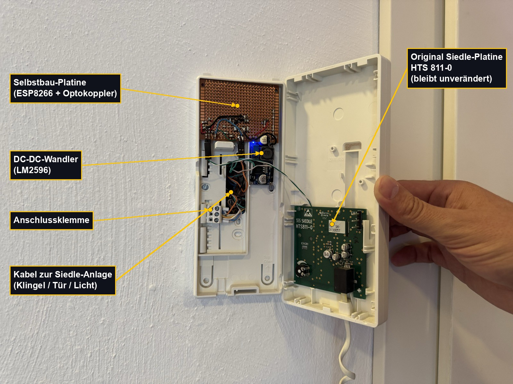
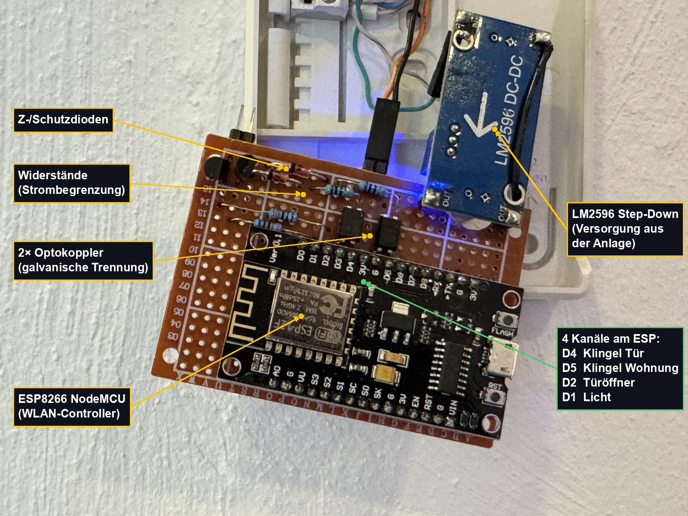
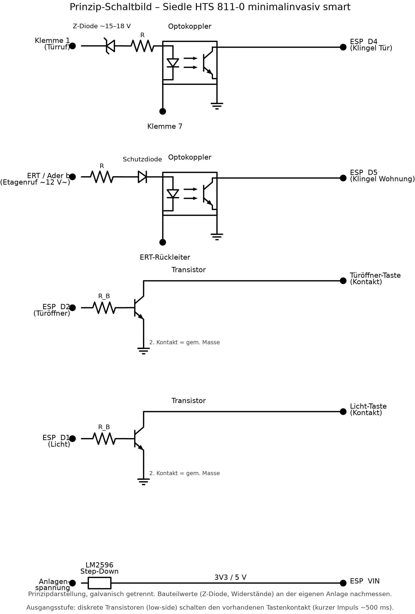
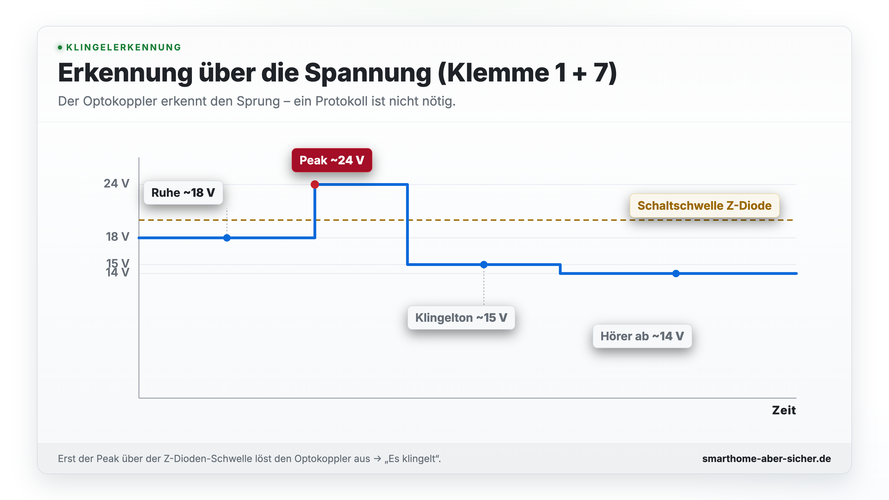
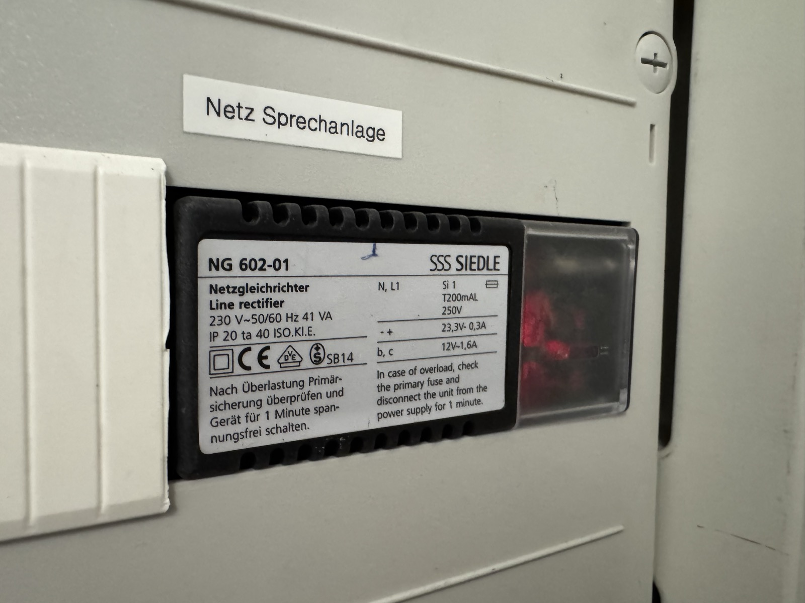
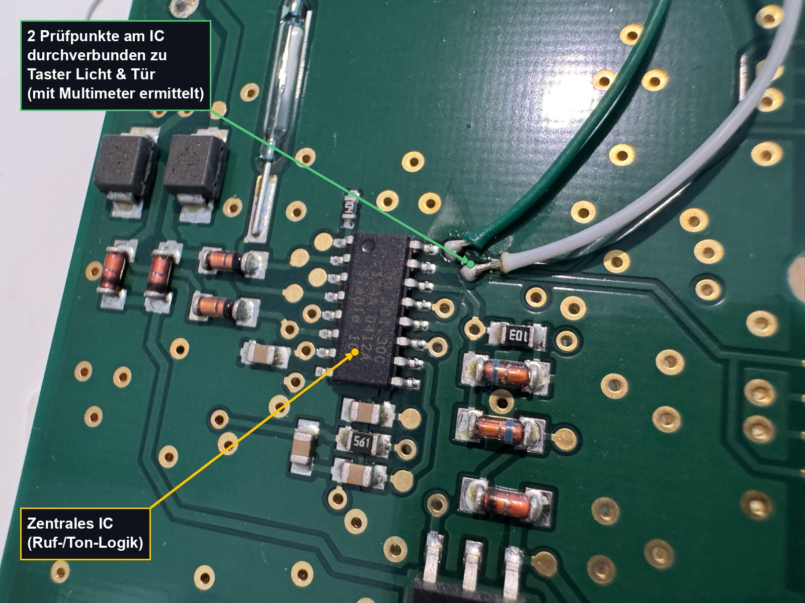

# Hardware & Verdrahtung – Siedle HTS 811-0 (1+n)

> Diese Werte gelten für **genau meine Anlage** (Siedle Haustelefon HTS 811-0,
> 1+n-Technik). Bei anderen Geräten/Generationen können Klemmen und Spannungen
> abweichen. Immer selbst nachmessen.

## Prinzip

Zwei Aufgaben, mehr nicht:

- **Signale erkennen** (Eingang): Ein Optokoppler wird über einen Vorwiderstand parallel
  an das Klingelsignal gehängt. Ändert sich die Spannung (es klingelt), zieht der
  Optokoppler den ESP-Eingang auf Masse.
- **Knöpfe drücken** (Ausgang): Ein ESP-Ausgang „drückt" für ~500 ms parallel zur
  vorhandenen Taste (Türöffner / Licht) – wie ein zusätzlicher Finger.

Die Anlage selbst bleibt unverändert und voll funktionsfähig.

<picture>
  <source media="(prefers-color-scheme: dark)" srcset="images/sb1-kanaluebersicht-dark.png">
  
</picture>

> **Warum so vorsichtig?** In diesem Haus teilen sich **5 Wohnungen** dieselbe
> Sprechanlage. Ein Fehler auf der Busleitung würde die Anlage aller Nachbarn stören –
> daher galvanische Trennung und kein direkter Eingriff in die Busleitung.

<picture>
  <source media="(prefers-color-scheme: dark)" srcset="images/sb5-fuenf-wohnungen-dark.png">
  
</picture>

## Aufbau (beschriftet)

Gesamtübersicht im geöffneten Gehäuse – die Original-Siedle-Platine bleibt rechts
unverändert, links sitzt der Zusatz:

Der Controller aus der Nähe: ESP8266 NodeMCU, LM2596-Step-Down, Optokoppler,
Vorwiderstände und Z-/Schutzdioden auf der Lochrasterplatine. Eingezeichnet sind auch
die vier Kanäle am ESP (D4/D5 Eingänge, D1/D2 Ausgänge):

> Hinweis zur Bauteil-Identifikation: Optokoppler (schwarze 4-Pin-Gehäuse) und Z-/Schutz-
> dioden sitzen im **Eingangspfad** (Klingelerkennung). Die **Ausgänge** (Türöffner/Licht)
> schalten über **diskrete Transistoren** die vorhandenen Tastenkontakte.

## Prinzip-Schaltbild

Vier Kanäle plus Versorgung – galvanisch getrennt, damit der 1+n-Bus nicht belastet wird:

<picture>
  <source media="(prefers-color-scheme: dark)" srcset="images/schaltbild-dark.png">
  
</picture>

Das ist eine **Prinzipdarstellung**: Eingänge galvanisch getrennt per Optokoppler
(mit Z-Diode bzw. Schutzdiode + Vorwiderstand), Ausgänge über **diskrete Transistoren**
(low-side), die den vorhandenen Tastenkontakt gegen die gemeinsame Masse schalten. Die
konkreten Bauteilwerte (Z-Diode, Vorwiderstände, Basiswiderstände) an der eigenen Anlage
nachmessen bzw. anpassen.

## Pin-Belegung (ESP8266 NodeMCU)

| Funktion         | Richtung | ESP-Pin | ESPHome                         |
|------------------|----------|---------|---------------------------------|
| Klingel Tür      | Eingang  | D4      | `binary_sensor` (pullup, inv.)  |
| Klingel Wohnung  | Eingang  | D5      | `binary_sensor` (pullup, inv.)  |
| Licht            | Ausgang  | D1      | `switch` (500 ms Puls)          |
| Türöffner        | Ausgang  | D2      | `switch` (500 ms Puls)          |

## Spannungsverlauf beim Türruf (1+n)

Gemessen zwischen Klemme **1** und **7**:

| Phase                | Spannung   | Bedeutung                          |
|----------------------|------------|------------------------------------|
| Ruhezustand          | ~18 V DC   | Dauerspannung, nichts passiert     |
| Klingeltaste gedrückt| ~24 V DC   | kurzer Peak                        |
| Klingelton läuft     | ~15 V DC   | 3-Ton-Ruf wird übertragen          |
| Hörer abgehoben      | ~14 V DC   | Sprechzustand                      |

Der Optokoppler erkennt genau diese Spannungsänderung – ein Protokoll ist nicht nötig.

<picture>
  <source media="(prefers-color-scheme: dark)" srcset="images/sb2-spannungsverlauf-dark.png">
  
</picture>

## ⚠️ Signal sicher abgreifen (der wichtigste Punkt)

Die 1+n-Anlage reagiert empfindlich auf Belastung der Busleitung. Deshalb gilt:

**Niemals ein normales Relais oder einen Smart-Home-Sender (Shelly, Homematic o. ä.)
direkt an Klemme 1 und 7 hängen.** Das belastet/stört den Bus und kann die
Sprechanlage im **ganzen Haus** lahmlegen.

Sichere Wege (galvanische Trennung):

- **Offiziell:** Siedle **NSC 602** (Nebensignalcontroller) – liest das Protokoll mit und
  liefert einen potentialfreien Relaiskontakt. Sauber, aber Zusatzkosten und weniger DIY.
- **DIY (dieses Projekt):** Optokoppler **hochohmig** und galvanisch getrennt anhängen,
  sodass der Bus praktisch nicht belastet wird.

### Klingel Tür (Türruf an Klemme 1 + 7)

Im Ruhezustand liegen dauerhaft ~18 V DC an – ein Optokoppler würde also permanent
durchschalten. Trick: eine **Zener-Diode (~15–18 V) in Reihe** vor den Optokoppler.

- Ruhezustand (~18 V): Zener sperrt bzw. lässt zu wenig durch → Optokoppler **aus**
- Klingel-Peak (~24 V): Zener bricht durch → Optokoppler **an** → ESP erkennt „es klingelt"

Vorwiderstand nach der Faustformel `R = U / I` (Community-Erfahrung: ~470 Ω bei ~20 mA;
Werte hängen von der konkreten Anlage ab → **selbst nachmessen, wenn jemand klingelt**).

### Klingel Wohnung (Etagenruf an ERT / Ader b)

Hier liegt beim Drücken meist **Wechselspannung** (~12 V AC) an. Optokoppler daher mit
Vorwiderstand **und** Berücksichtigung der AC (z. B. antiparallele Diode / Gleichrichtung),
damit die interne LED nicht in Sperrrichtung überlastet wird.

## Stromversorgung

Ein **LM2596** Step-Down-Wandler erzeugt aus der Anlagenspannung die Versorgung für den
ESP8266.

Gespeist wird die Anlage im Haus zentral aus einem **Siedle NG 602-01**
Netzgleichrichter (im Keller-Schaltschrank, „Netz Sprechanlage"):

| Ausgang        | Spannung | Strom  | Verwendung                          |
|----------------|----------|--------|-------------------------------------|
| `– +`          | 23,3 V   | 0,3 A  | Anlagen-/Sprechspannung (1+n-Bus)   |
| `b, c`         | 12 V     | 1,6 A  | u. a. Türsummer / Etagengong        |

Primär 230 V~ 50/60 Hz, 41 VA, Feinsicherung T200 mA.

Der ESP wird über den LM2596 aus dieser vorhandenen Anlagenspannung mitversorgt – kein
zusätzliches Steckernetzteil, und weil der Wandler hochohmig nur wenige mA zieht, bleibt
für die Nachbar-Innenstationen praktisch alles wie vorher.

> TODO: Exakte Eingangsader am LM2596 und die gemessene Stromaufnahme des ESP im
> WLAN-Betrieb ergänzen – als Beleg, dass der 1+n-Bus / andere Innenstationen nicht
> belastet werden.

## Ausgangsstufe (Tasten drücken)

Türöffner und Licht werden **parallel zur vorhandenen Taste** geschaltet – der ESP
„drückt" den Knopf für ~500 ms. Umgesetzt über **diskrete Transistoren** (low-side): ein
Basiswiderstand vom ESP-Pin, der Transistor schaltet den Tastenkontakt gegen die
gemeinsame Masse (die über den LM2596 mit der Anlage geteilt wird).

Wichtig für den minimalinvasiven Ansatz: Angeschlossen wird **nicht direkt an den Tastern**,
sondern an **zwei Prüfpunkten auf der Platinenrückseite** nahe dem zentralen IC. Diese
Punkte sind mit den Tastenkontakten **durchverbunden** – per Multimeter ermittelt (Durchgang
zur jeweiligen Taste). Das spart Löten an den mechanisch belasteten Tastern und lässt die
Bedienung von Hand unverändert.

**Warum nicht die Frequenz nachbauen?** Bei 1+n sind „Tür öffnen" und „Licht" keine
digitalen Befehle, sondern **aufmodulierte Tonfrequenzen** (~20–22 kHz) auf der
DC-Sprechspannung (~14–16 V) zwischen Klemme 1 und 7:

- Ein Oszillator im Haustelefon erzeugt beim Tastendruck einen festen Ton.
- Die Außenstation erkennt „ihre" Frequenz per **Bandpass-Filter** und schaltet ein
  Relais → Türsummer (meist 12 V AC vom Netzgerät).
- Die Lichttaste nutzt dasselbe Prinzip mit **anderer Frequenz**.

<picture>
  <source media="(prefers-color-scheme: dark)" srcset="images/sb3-fmton-dark.png">
  
</picture>

Diesen Ton selbst zu erzeugen und auf 1+7 einzuspeisen wäre riskant (kann Filter/Nachbar-
Anlagen stören). Deshalb: **einfach die mechanische Taste parallel schalten** – der
originale Oszillator des Telefons macht den Rest, sicher und ohne die Anlage zu belasten.
Der Tastendruck funktioniert **auch bei aufgelegtem Hörer**, die automatische Türöffnung
braucht also keinen mitgeschalteten Hörzustand.

Das Prinzip-Schaltbild oben zeigt die Ausgangsstufe als diskreten Transistor am
Tastenkontakt.

> TODO: Konkrete Bauteilwerte (Transistortyp, Basiswiderstand) im Schaltbild ergänzen.

## Quellen & verwandte Projekte

- [Siedle HTS 811-0 – Haustelefon Standard](https://www.siedle.de/de-de/produkte/hts-811-0-w-haustelefon-standard/)
  (Produkt-/Dokumentseite, 1+n Systemhandbuch & Bedienungsanleitung)
- [richis-lab.de – Siedle](https://www.richis-lab.de/Siedle.htm) (Analyse der Siedle-Elektronik)
- [mikrocontroller.net – „Klingelanschaltung für 1+n Systeme Fa. Siedle"](https://www.mikrocontroller.net/topic/264481)
  (Diskussion zum Türöffner-/Frequenzprinzip)
- Community zu Optokoppler-Dimensionierung & Türöffner:
  [ioBroker-Forum](https://forum.iobroker.net) ·
  [Home-Assistant-Community](https://community.home-assistant.io) ·
  [simon42](https://www.simon42.com)
- [SmartHome yourself](https://www.smarthomeyourself.de/) – „Make any doorbell smart with D1 Mini"
  (generische Klingel, gleiches Grundprinzip; hier speziell für den heiklen 1+n-Bus gelöst)

